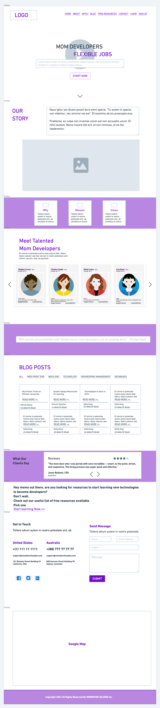

# flask-app

## Tech Used

-   HTML
-   CSS
-   Javascript
-   Python

Get this repo by forking it, and cloning your fork, or by cloning this repo directly or by downloading the zip somewhere to your coursework folder.

## Setup

This project uses virtualenv and `requirements.txt`.

Enter the repo:

```
cd flask-app
```

Create a venv:

```
python -m venv venv
```

Activate venv:

```
. venv/bin/activate
```

Install dependencies using `requirements.txt`

```
pip install -r requirements.txt
```

Create a Postgres database called `mom-devs-flex-jobs` (or any name, just then you will have to update the PG code in the app to work with your db name)

```
createdb profiles
```

Create schema and insert test data

```
psql mom-devs-flex-jobs < schema.sql
```

Or open `schema.sql` and take only the parts you want.

## Planning

-Here's the planning


**1. Create html files for contents:**

    - Introduction: Connecting mom developers with the tech industry for flexible jobs. Hiring platform for mom talents for flexible developer positons.
    - For each profile page, add availability: Part-time or Full-time
    - For each profile page, add year of experience
    - Make apply link leading to add, edit,delete a profile page
    - Add location icon for each profile
    - Add Blog post page and make blog post link to lead to different blog posts
    - Add review page inclucing table in backend for user interation
    - Add why mission and vision section and add content for each of them
    - Figure out interative google map

**2. Add style to the contents by adding style.css**

    - Start planning out the css styles for each page

**3. Add Javascript main.js**

**4. Things to improve**

    - Include hiring scope from the company perspective.
    - Include one button on the top-left with other hidden buttons leading to different routes: React.js Developers, C++ Developers, Android Developers, iOS Developers..
    - Add Hire top mom dev talent link which leads to:
    - Add "Hiring for a specific skill? Find mom devs to hire" page which leads to the following with logo for each skill:
    -- Android Developers, Angular Developers, AWS Developers, Azure Developers, Blockchain Developers, C Developers, C# Developers, C++ Developers, CSS Developers, Django Developers, Go Engineers, iOS Developers, Java Developers, JavaScript Developers, Kubernetes Experts, .NET Developers, Node.js Developers, PHP Developers, Python Developers, React.js Developers, React Native Developers, Ruby Developers, Ruby on Rails Developers, Scala Developers, Shopify Developers, SQL Developers, Swift Developers, Vue.js Developers, WordPress Developers....
    - Add logo for each tech skill - Possibily look for a job Board API for developers and intergrate it into the current website as time allows

**5. BackEnd**

    -Due to tight schedule, work with 2 psql tables first: talent_users and mom_dev_profiles
    -If time allows, add in more tables: company_reviews, blogs, hiring_users, and messages
